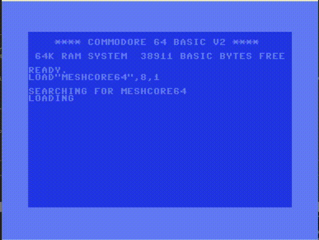

# MeshCore64

A Commodore 64 chat client for [MeshCore](https://github.com/ripplebiz/MeshCore) mesh radio networks. Connects to a MeshCore companion device via a SwiftLink cartridge and lets you send and receive messages over LoRa mesh.


## Demo



## Features

- **Channel messaging** &mdash; Send and receive on up to 8 mesh channels
- **Direct messages** &mdash; Private 1:1 conversations with up to 32 contacts, each with a dedicated message buffer
- **Delivery confirmation** &mdash; DM messages turn from yellow (pending) to green when delivery is acknowledged
- **@-mention cycling** &mdash; Press Up/Down to cycle through senders in the current channel and auto-insert `@[name]` mentions
- **Persistent config** &mdash; Companion IP:port saved to disk (floppy or SD on device 8) so you only configure once
- **Auto-reconnect** &mdash; Detects connection loss and automatically redials
- **NMI-driven serial** &mdash; Interrupt-driven receive buffer prevents lost bytes during screen updates

## Hardware Requirements

- Commodore 64 (or emulator)
- **SwiftLink** RS-232 cartridge (directly, or via [Ultimate 64](https://ultimate64.com) / [1541 Ultimate](https://1541ultimate.net))
- Connection to a MeshCore companion device running the TCP serial bridge (`meshcore_py`)
- Optional: floppy drive or SD card on device 8 for config persistence

## Building

Requires the [cc65](https://cc65.github.io/) 6502 C compiler toolchain.

```bash
# Install cc65 (macOS)
brew install cc65

# Build
make
```

This produces `build/meshcore64.prg`.

## Running in VICE (Emulator)

The easiest way to test is with the [VICE](https://vice-emu.sourceforge.io/) emulator and [tcpser](https://github.com/FozzTexx/tcpser) as a TCP-to-modem bridge.

```bash
# Install dependencies (macOS)
brew install vice tcpser

# Build and run (starts tcpser + VICE with SwiftLink emulation)
make run
```

Or manually:

```bash
# 1. Start tcpser (bridges TCP to modem AT commands)
tcpser -v 25232 -s 9600 -l 4 &

# 2. Create a disk image for config persistence
c1541 -format "meshcore,mc" d64 build/meshcore64.d64
c1541 -attach build/meshcore64.d64 -write build/meshcore64.prg meshcore64

# 3. Launch VICE with SwiftLink cartridge
x64sc \
    -acia1 -acia1base 56832 -acia1mode 1 -acia1irq 1 \
    -myaciadev 2 \
    -rsdev3 127.0.0.1:25232 -rsdev3baud 9600 -rsdev3ip232 \
    -8 build/meshcore64.d64 \
    -autostart build/meshcore64.prg
```

## Usage

On first launch you'll see a setup screen to enter your companion device's IP:port (e.g., `192.168.2.145:5000`). This is saved to disk for subsequent launches.

### Keyboard

| Key | Action |
|-----|--------|
| **Return** | Send message |
| **Del** | Backspace |
| **F1 / F3** | Next / previous channel |
| **F5 / F7** | Next / previous DM contact |
| **Up / Down** | Cycle @-mention target (channels only) |
| **F2** | Settings (edit companion address) |

### Message Colors

| Color | Meaning |
|-------|---------|
| Yellow (sender) | Your message, sent to radio |
| Green (sender) | Your DM, delivery confirmed |
| Light blue | @-mention of another user |
| Yellow (text) | @-mention of you |

## Project Structure

```
src/
  main.c        Main loop, UI logic, mention cycling
  meshcore.c    MeshCore protocol (framing, commands, message parsing)
  serial.c      SwiftLink ACIA driver (polling + NMI modes)
  screen.c      40-column display, per-channel message buffers
  input.c       Non-blocking keyboard handling
  config.c      Persistent config via CBM file I/O
  nmi_acia.s    NMI interrupt handler for serial receive
  charset.h     PETSCII / ASCII / screen code conversion
scripts/
  run.sh        Launch helper (tcpser + VICE)
```

## Protocol

Communicates with a MeshCore companion device using the binary TCP serial protocol defined in [meshcore_py](https://github.com/ripplebiz/MeshCore). The companion device handles all radio operations; this client sends commands and receives messages over the serial link at 9600 baud.

## License

MIT
